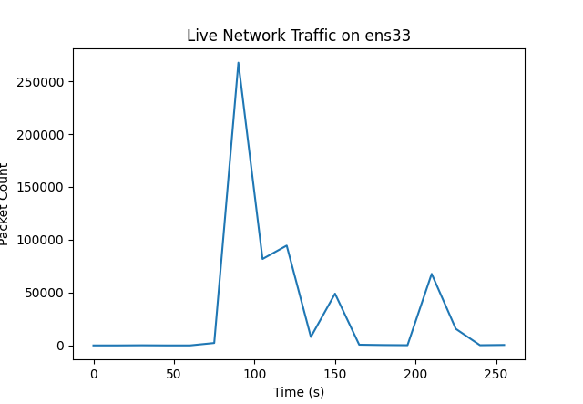

# Packet Capture and Traffic Analysis

This program captures packets on the network interface `ens33` and displays a live time animated line graph of the packet count. The intervals on the x-axis are set every 15 seconds and the graph updates every 15 seconds.

## Requirements
- Python 3.x
- Matplotlib library
- Psutil library

## Usage
```
python packet_capture.py
```



